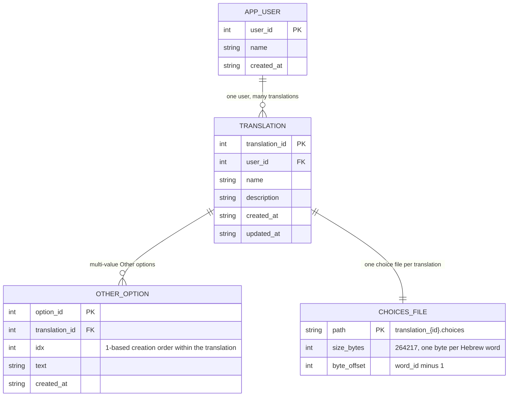
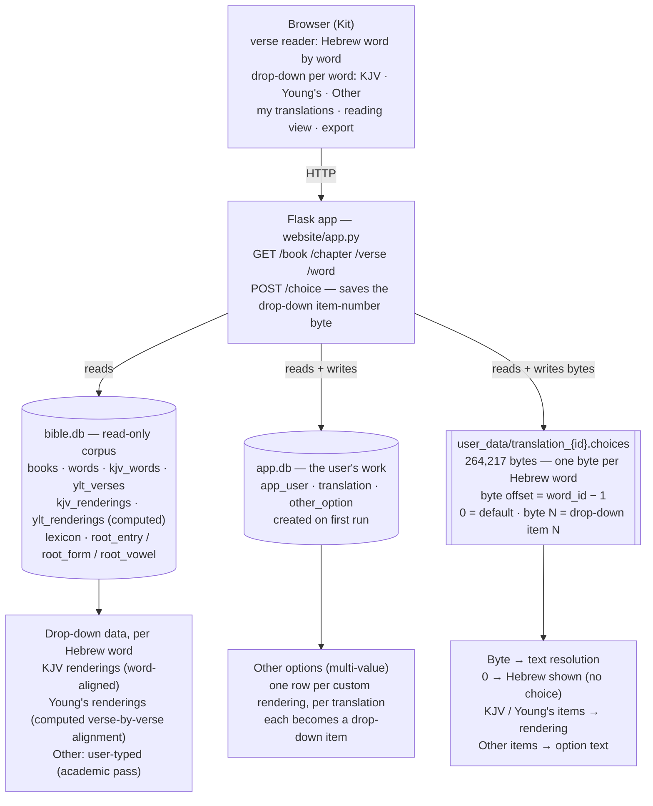

# Bible Project

A Hebrew Bible database and build-your-own-translation website. Every
unpointed Hebrew word gets a dropdown of academically sourced renderings;
readers pick word by word and save their own translation.

**Public-domain sources only.** No NIV, no HALOT.

## What's here

| File | Purpose |
|---|---|
| `NOTATION_LEDGER.md` | Living record: Hebrew notation conventions, book numbering, source labels, open items |
| `er_diagram.png` / `.svg` | Entity-relationship diagram |
| `system_diagram.png` / `.svg` | System architecture diagram |
| `er.py`, `sys.py` | Diagram generators (matplotlib) |
| `ingest_canonical.py` | Ingests Kit's spreadsheets, picks the canonical word list |
| `assemble_bible.py` | Full assembly: crosswalk to OSHB, KJV/YLT/gloss loading, SQLite build |
| `fixup_notes.py`, `diff_corrected.py` | One-off cleaning passes |
| `oshb_crosswalk_report.json` | OSHB alignment statistics |
| `assembly_report.json` | Final build verification numbers |
| `spotcheck.txt` | Human-readable verse samples |

## The database (built 2026-09-20)

`bible.db` (SQLite, git-ignored — rebuild with `assemble_bible.py`):

| Table | Rows | Notes |
|---|---|---|
| `words` | 264,217 | One row per Hebrew/Aramaic token; morphology parsed; Strong's via OSHB crosswalk |
| `kjv_renderings` | 409,930 | KJV word renderings aligned to Hebrew words |
| `kjv_words` | 610,324 | Raw KJV+Strong's word list |
| `ylt_verses` | 23,145 | Young's Literal Translation, verse level |
| `glosses` | 17,347 | BDB + Strong's dictionary glosses, full H1–H8674 |
| `books` | 39 | English + Hebrew names |
| `root_entry` | 30,087 | The project's own numbering: one row per distinct unpointed base word, Hebrew alphabetical order |
| `root_form` | 57,724 | Numbered prefix/suffix patterns beneath each root |
| `root_vowel` | 126,869 | Numbered pointed (vocalized) forms beneath each (root, form); `words.root_code` = `root.fix.vowel` |
| `lexicon` | 126,869 | One row per `root_vowel` entry: KJV renderings (word-level, most frequent first), YLT verse contexts (verse-level), and the verse list where the form is found |

**Numbering.** The project's primary word numbering is root-based (built
2026-09-21, replacing Kit's earlier numbering), in three tiers: every distinct
unpointed base word is a numbered root entry, each attested prefix/suffix
pattern beneath it is a numbered form, and each distinct pointed (vocalized)
form beneath that is a numbered vowel pattern. Every one of the 264,217 words
carries a `root_code` like `19247.42.1` (root מלכ, "the king" form, first
vocalization). Strong's numbers are kept as a foreign key into the
public-domain lexicons.

Coverage: 175,449 of 264,217 words carry a Strong's number (66.4%);
every one of those has at least one gloss. 134,625 words (50.9%) have a
KJV rendering. 4,405 Aramaic words flagged. The remaining gap is a
crosswalk alignment limitation (OSHB splits maqqef-joined words; Kit's
files don't) — see `oshb_crosswalk_report.json`.

## Sources (all public domain / freely licensed)

- Kit's spreadsheets: BibleFull (v 1).xlsx, Prophets.ods, Verses.ods
- OSHB / morphhb (Open Scriptures Hebrew Bible) — Hebrew text + Strong's + morphology
- KJV + Strong's (Crosswire)
- Young's Literal Translation (ebible.org eng-ylt, USFM)
- BDB + Strong's Hebrew dictionary (Open Scriptures HebrewLexicon)

## Status

Database built; website built and tested locally (2026-09-22). Open items are tracked as `U-`
items in `NOTATION_LEDGER.md`.

## Website (built 2026-09-22, Flask + SQLite)

- Over each Hebrew word: a drop-down box for choosing that word's rendering.
- Drop-down options: the **KJV** rendering, the **Young's** rendering
  (COMPUTED via KJV-bridge word alignment — labeled "Young's (computed)" in the
  UI; see U-1 for honest coverage numbers), and **other** — user-defined, for
  the academic pass.
- Choosing word by word builds and saves the user's own translation (named
  translations; per-word choices persist as **one byte per word** in
  `website/user_data/translation_<id>.choices` — 264,217 bytes, byte at offset
  `word_id − 1` = the selected drop-down item number, 0 = default).
  Multi-value "Other" renderings live in `website/app.db` (`other_option` table).
- Browse: `/` books → `/book/<n>` chapters → `/chapter/<n>/<c>` verses →
  `/verse/<n>/<c>/<v>` words. Reading view `/reading/<tid>/<n>/<c>/<v>`;
  export `/export/<tid>`; word detail `/word/<wid>` (pointed/unpointed, letters,
  root code, Strong's, renderings, contexts, verses).
- `bible.db` is opened read-only; all user data lives in `website/app.db`
  (`app_user`, `translation`, `other_option` tables — `website/schema.sql`) plus
  the per-translation byte files in `website/user_data/` (one byte per word;
  git-ignored, personal data stays local).
  Run: `cd website && ./venv/bin/python app.py`
  (port 5057).

## Diagrams

Text-first: `website/website_er.mmd` and `website/website_system.mmd` are the
diagram sources (Mermaid — renders live on GitHub below). The `.png`/`.svg`
copies are built from `website/website_diagrams.py` (matplotlib).

<!-- MERMAID-ER-START -->

<!-- MERMAID-ER-END -->

<!-- MERMAID-SYSTEM-START -->

<!-- MERMAID-SYSTEM-END -->
