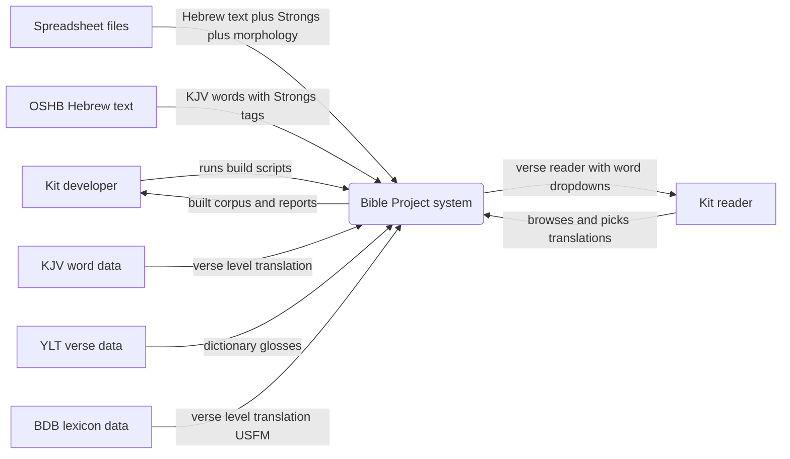
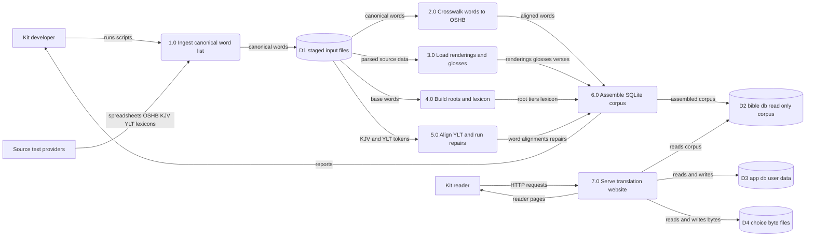
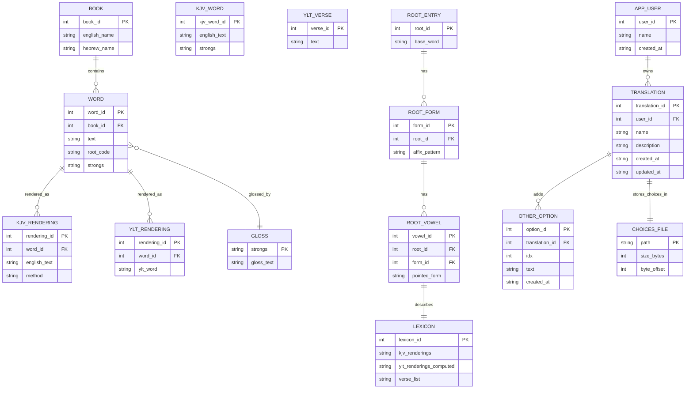

Living document — update these diagrams when adding features.

# bible-project — Architecture

**Relationship to Bible:** this repo is the current, live Bible Project. `cosbykit-afk/Bible` is an earlier partial copy of the same project — its own repo description says so ("Earlier partial Bible-database copy; current work continues in the bible-project repository"). Do not treat them as two independent systems: bible-project is the continuation with the U-8 maqqef-component repair, the U-9 verse-remap repair, YLT word alignment, and the Flask translation website, none of which exist in the older Bible repo.

## 1. Context diagram (level 0)

## 2. Level-1 data flow diagram

## 3. Entity–relationship diagram

## Grounding notes

- Observed: README.md documents the same 11-table corpus as the older repo plus `ylt_renderings` (337,601 rows, computed best-effort); exact row counts for words 264,217, kjv_renderings 631,950, kjv_words 610,324, ylt_verses 23,145, glosses 17,347, books 39, root_entry 30,087, root_form 57,724, root_vowel 126,869, lexicon 126,869.
- Observed: repair scripts named `repair_u8_maqqef_kjv.py`, `repair_u8_lexicon.py`, `repair_u9_verse_remap_kjv.py`, `repair_u9_lexicon.py`, `u9_verse_remap.tsv`, plus `build_ylt_align.py` and `measure_ylt_coverage.py` — the basis for process 5.0. README describes the U-8 maqqef-component repair and U-9 verse-remap repair with before/after coverage figures.
- Observed: `worker-out/` subdirectories (canon, kjv, lexicons, oshb, ylt) with staged TSV/zip/USFM inputs and per-source README.txt — the basis for D1.
- Observed: `website/app.py` (Flask, port 5057): opens bible.db read-only, app.db read-write, `user_data/translation_<id>.choices` byte files; routes for book/chapter/verse/word/choice/translations/reading/export. `website/schema.sql` defines `app_user`, `translation`, `other_option` verbatim. `website/STATUS.md` documents the end-to-end local test (all routes 200, choice persistence, reading composition, export).
- Observed: the repo ships its own `website_er.mmd` / `website_system.mmd` Mermaid sources — the website half of this ERD and DFD follows their structure (entities, byte-file choice storage, cross-database logical FK on word_id).
- INFERRED: process numbering 1.0–6.0 groups scripts by README-described purpose (ingest → crosswalk → renderings → roots/lexicon → alignment/repairs → assemble); the repo documents each script's role but no explicit pipeline wiring between them, so the numbered process boundaries are inferred.
- INFERRED: ERD primary/foreign key names and attributes for the corpus tables (words, kjv_renderings, ylt_renderings, glosses, root_*, lexicon) are inferred from README prose; no corpus schema.sql was observed. Website entity attributes were observed verbatim in schema.sql.
- INFERRED: that the flat choices file (one byte per word at offset word_id−1) and cross-db word_id references are enforced by application code only — observed in schema.sql comments and STATUS.md, stated as design fact by the repo.
