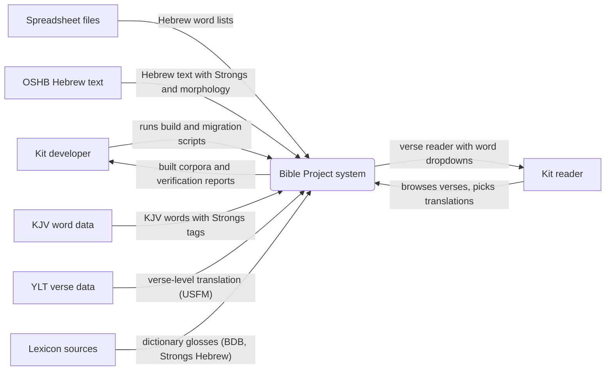
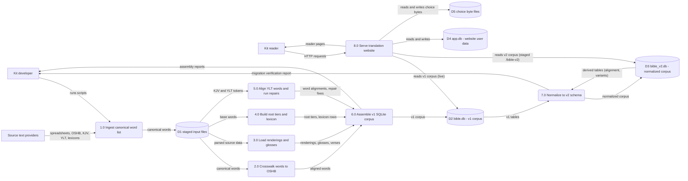

Living document — update these diagrams when adding features.

# bible-project — Architecture

**Relationship to Bible:** this repo is the current, live Bible Project. `cosbykit-afk/Bible` is an earlier partial copy of the same project — its own repo description says so ("Earlier partial Bible-database copy; current work continues in the bible-project repository"). Do not treat them as two independent systems: bible-project is the continuation with the U-8 maqqef-component repair, the U-9 verse-remap repair, YLT word alignment, the Flask translation website, and the v2 normalization, none of which exist in the older Bible repo.

**v2 status (2026-09-28):** the corpus has been normalized to the v2 schema (`schema_v2.sql`, design rationale in `schema_v2.md`). `bible_v2.db` is built and verified; the live website still serves the v1 `bible.db` — cutover awaits Kit's schema review. The diagrams below describe v2 with the v1-serving website called out explicitly.

## 1. Context diagram (level 0)



## 2. Level-1 data flow diagram



Process grounding: 1.0 `ingest_canonical.py`; 4.0 `build_roots*.py` + `build_lexicon.py`; 5.0 `build_ylt_align.py`, `repair_u8_maqqef_kjv.py`, `repair_u8_lexicon.py`, `repair_u9_verse_remap_kjv.py`, `repair_u9_lexicon.py`; 6.0 `assemble_bible.py`; 7.0 `migrate_v2.py` then the derived-data stage `build_alignment.py`, `build_variants.py`, `apply_morph_corrections.py`; 8.0 `website/app.py` (live, port 5057) and `website/app_v2.py` (staged, port 5058, pending Kit's schema review).

## 3. Entity–relationship diagram (v2 schema)

```mermaid
erDiagram
    BOOKS {
        int book_id PK
        string name_en
        string name_he
    }
    VERSES {
        int verse_id PK
        int book_id FK
        int chapter
        int verse
    }
    WORDS {
        int word_id PK
        string orig_word_id
        int verse_id FK
        int word_pos
        string pointed
        string unpointed
        string letters
        string strongs FK
        int strongs_source_id FK
        int morph_pattern_id FK
        int is_aramaic
        int root_id FK
        int root_form_seq FK
        int root_vowel_seq FK
    }
    STRONGS {
        string strongs PK
        string language
    }
    STRONGS_COMPONENTS {
        string strongs FK
        int seq
        string component
    }
    STRONGS_SOURCES {
        int source_id PK
        string source
    }
    MORPH_PATTERNS {
        int pattern_id PK
        string pattern
        string language
        string parse_status
        string parse_notes
    }
    MORPH_SEGMENTS {
        int segment_id PK
        int pattern_id FK
        int seq
        string code
        string pos
        string stem
        string person
        string gender
        string number
        string state
    }
    ROOT_ENTRY {
        int root_id PK
        string root
        int word_count
    }
    ROOT_FORM {
        int root_id FK
        int form_seq
        string prefix1
        string suffix1
        int word_count
        string example_pointed
    }
    ROOT_VOWEL {
        int root_id FK
        int root_form_seq FK
        int vowel_seq
        string vowel_pattern
        int word_count
    }
    LEXICON {
        int root_id FK
        int root_form_seq FK
        int vowel_seq FK
    }
    LEXICON_KJV_RENDERING {
        int root_id FK
        int root_form_seq FK
        int vowel_seq FK
        int seq
        string rendering
    }
    LEXICON_YLT_RENDERING {
        int root_id FK
        int root_form_seq FK
        int vowel_seq FK
        int seq
        string rendering
    }
    LEXICON_YLT_CONTEXT {
        int root_id FK
        int root_form_seq FK
        int vowel_seq FK
        int seq
        int verse_id FK
        string context_text
    }
    LEXICON_FOUND_VERSE {
        int root_id FK
        int root_form_seq FK
        int vowel_seq FK
        int verse_id FK
    }
    GLOSSES {
        string strongs FK
        string source
        string gloss
    }
    KJV_WORDS {
        int kjv_word_id PK
        int verse_id FK
        int kjv_pos
        string kjv_word
        string strongs FK
    }
    KJV_RENDERINGS {
        int rendering_id PK
        int word_id FK
        string kjv_word
        string kjv_strongs FK
        string method
    }
    YLT_VERSES {
        int verse_id PK_FK
        string text
    }
    YLT_RENDERINGS {
        int rendering_id PK
        int word_id FK
        string ylt_word
        int ylt_word_pos
        string label
    }
    WORD_ALIGNMENT {
        int alignment_id PK
        int verse_id FK
        int seq
        int hebrew_word_id FK
        int kjv_word_id FK
        int ylt_rendering_id FK
        string syntactic_role
        string role_basis
    }
    WORD_VARIANTS {
        int word_id FK
        int variant_seq
        string unpointed
        string letters
        string convention
        string source
        string basis
    }
    MORPH_VARIANTS {
        int word_id FK
        int variant_seq
        string morph_code
        int pattern_id FK
        string confidence
        string source
        string basis
    }
    APP_USER {
        int user_id PK
        string name
        string created_at
    }
    TRANSLATION {
        int translation_id PK
        int user_id FK
        string name
        string description
        string created_at
        string updated_at
    }
    OTHER_OPTION {
        int option_id PK
        int translation_id FK
        int idx
        string text
        string created_at
    }
    CHOICES_FILE {
        string path PK
        int size_bytes
    }
    BOOKS ||--o{ VERSES : contains
    VERSES ||--o{ WORDS : contains
    VERSES ||--o{ KJV_WORDS : contains
    VERSES ||--|| YLT_VERSES : has_text
    VERSES ||--o{ WORD_ALIGNMENT : aligns
    WORDS }o--|o STRONGS : tagged_with
    WORDS }o--|o STRONGS_SOURCES : source_recorded_in
    WORDS }o--|o MORPH_PATTERNS : parsed_as
    STRONGS ||--o{ STRONGS_COMPONENTS : decomposes_to
    STRONGS ||--o{ GLOSSES : glossed_by
    MORPH_PATTERNS ||--o{ MORPH_SEGMENTS : splits_into
    ROOT_ENTRY ||--o{ ROOT_FORM : has
    ROOT_FORM ||--o{ ROOT_VOWEL : has
    ROOT_VOWEL ||--|| LEXICON : describes
    WORDS }o--|| ROOT_VOWEL : numbered_as
    LEXICON ||--o{ LEXICON_KJV_RENDERING : lists
    LEXICON ||--o{ LEXICON_YLT_RENDERING : lists
    LEXICON ||--o{ LEXICON_YLT_CONTEXT : cites
    LEXICON ||--o{ LEXICON_FOUND_VERSE : found_in
    LEXICON_YLT_CONTEXT }o--|| VERSES : quotes
    LEXICON_FOUND_VERSE }o--|| VERSES : locates
    KJV_WORDS }o--|o STRONGS : tagged_with
    WORDS ||--o{ KJV_RENDERINGS : rendered_as
    KJV_RENDERINGS }o--|o STRONGS : via_kjv_strongs
    WORDS ||--o{ YLT_RENDERINGS : rendered_as
    WORD_ALIGNMENT }o--|o WORDS : hebrew_side
    WORD_ALIGNMENT }o--|o KJV_WORDS : kjv_side
    WORD_ALIGNMENT }o--|o YLT_RENDERINGS : ylt_side
    WORDS ||--o{ WORD_VARIANTS : varies_as
    WORDS ||--o{ MORPH_VARIANTS : morph_readings
    MORPH_VARIANTS }o--|o MORPH_PATTERNS : staged_as
    APP_USER ||--o{ TRANSLATION : owns
    TRANSLATION ||--o{ OTHER_OPTION : adds
    TRANSLATION ||--|| CHOICES_FILE : stores_choices_in
    TRANSLATION }o--o{ WORDS : targets
```

Notes on the ERD: composite primary keys (`ROOT_FORM`, `ROOT_VOWEL`, `LEXICON` and its children, `GLOSSES`, `WORD_VARIANTS`, `MORPH_VARIANTS`, `STRONGS_COMPONENTS`) are declared in `schema_v2.sql`; the `PK`/`FK` marks above show membership, not single-column keys. `YLT_VERSES.verse_id` is both PK and FK to `VERSES`. The `TRANSLATION }o--o{ WORDS : targets` link is logical, not a declared FK — corpus (`bible_v2.db`) and website data (`app.db`) are separate SQLite files by design; choice files index by `word_id` at byte offset `word_id - 1`.

## Grounding notes

- OBSERVED (`schema_v2.sql`, 24 tables): exact table/column names, PKs, FKs, UNIQUE and CHECK constraints quoted above; `words.strongs` nullable (6,008 words), `words.morph_pattern_id` nullable (79 words), `words.strongs_source_id` null iff strongs null (CHECK).
- OBSERVED (migration verification, 2026-09-28): `migrate_v2.py` completed in 66.9 s over 264,217 words; `v_words` 0 differing rows; 0 FK violations; lexicon round-trips 0 mismatches on 126,869 rows; `orig_word_id` not unique (51399, 252785, 227963 each map to 2 rows — split/merged tokens), so no UNIQUE constraint.
- OBSERVED: 1,865 composite Strong's values decomposed into 3,783 `strongs_components` rows (reconstruction assertion 1,865/1,865); 155 components (e.g. `H010`) have no row of their own, so components are NOT a hard FK to `strongs`.
- OBSERVED: `verses` = UNION of (book,chapter,verse) from words, ylt_verses, kjv_words — the 139 English-versification orphans (e.g. Genesis 31:55) resolve; 209 word-derived verses lack YLT.
- OBSERVED: 7,552 `morph_patterns`; `parse_status` parsed/unparsed per the OSHB Hebrew Morphology Codes document (openscriptures.github.io/morphhb/parsing/HebrewMorphologyCodes.html, fetched 2026-09-28, CC BY 4.0); `morph_variants` holds 28 staged readings over 12 words (confidence legacy/established/probable/secondary), never assigned to `words` until adjudicated.
- OBSERVED (`website/schema.sql`): `app_user`, `translation`, `other_option` verbatim; `website/app.py` (Flask, port 5057) opens `bible.db` read-only, `app.db` read-write, `user_data/translation_<id>.choices` byte files; routes for book/chapter/verse/word/choice/translations/reading/export.
- OBSERVED: `website/app_v2.py` (v2-aware port) written 2026-09-28; staged on the laptop behind `/bible-v2` (port 5058), 13/13 internal + 7/7 proxy 200s; live `/bible` untouched — NO live cutover; Kit's schema review is pending.
- OBSERVED: v1 row counts from README — words 264,217; kjv_words 610,324; kjv_renderings 631,950; ylt_renderings 337,601; ylt_verses 23,145; glosses 17,347; books 39; root_entry 30,087; root_form 57,724; root_vowel 126,869; lexicon 126,869.
- OBSERVED: `worker-out/` subdirectories (canon, kjv, lexicons, oshb, ylt) — the basis for D1; repair scripts named in 5.0; U-8 maqqef-component and U-9 verse-remap repairs with before/after coverage figures in README.
- INFERRED: the numbered process boundaries 1.0–8.0 group scripts by their documented purpose; the repo documents each script's role but no explicit pipeline wiring, so boundaries are inferred.
- INFERRED: `KJV_RENDERINGS.method` values 'direct' | 'maqqef-component' | 'verse-remap' and `YLT_RENDERINGS.label` = 'bridged' are observed in schema comments as the design's vocabulary.
